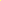
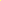

# remnic-codereview

**Memory-augmented code review bot** — learns from your team's past PR reviews and institutional knowledge to catch recurring issues in new pull requests.

## What was built

`remnic-codereview` is a CLI-first Node.js service that gives a repository **institutional memory** for code review. It ingests your team's past review comments, rules documents, post-mortems, CHANGELOG entries, and bug-fix commits into a structured memory store. On every new pull request, it retrieves relevant past lessons, judges whether they apply to the changed code, and posts inline review comments that cite the originating incident.

The system includes:

- **CLI** with subcommands for initialization, ingestion, lesson browsing, review, and serving
- **Ingestion pipelines** for rules files (CLAUDE.md, AGENTS.md, CONTRIBUTING.md), GitHub PR reviews (four surfaces: overall reviews, inline comments, threaded replies, issue-style comments), CHANGELOG, ADRs, post-mortems, closed issues, and fix/revert commits
- **Review pipeline** that fetches diffs, chunks by hunk, retrieves relevant lessons, judges applicability, composes inline comments with citation blocks, and posts to GitHub
- **Dashboard SPA** (React + Tailwind) with a Lessons browser and Reviews log
- **Express server** serving the JSON API and static dashboard
- **GitHub Action** (`action.yml`) for automated PR review in CI

## How it uses OpenAI

The bot uses OpenAI APIs extensively throughout the pipeline:

- **Responses API** — The primary interface to OpenAI models. Used for both lesson extraction (`openai.responses.parse` with structured output) and the judge step (`openai.responses.create` for verdict generation)
- **Structured Outputs** — Every OpenAI call uses `text.format` with `type: "json_schema"`, `strict: true`, and `additionalProperties: false` to guarantee parseable, schema-conformant responses. The extraction schema defines the full Lesson shape; the judge schema defines the ReviewVerdict shape
- **Batch API** — Supported for bulk lesson extraction when ingesting large repositories with many historical PRs, reducing per-request costs significantly
- **Prompt caching** — Stable system prompts and consistent schemas enable automatic 24-hour prompt caching, which reduces token costs on repeated ingestion and review operations
- **Embeddings** — Uses `text-embedding-3-small` (default) or `text-embedding-3-large` (high quality preset) via the Remnic memory backend for hybrid search retrieval of relevant lessons during the review pipeline
- **Model selection** — `gpt-5.4-mini` for lesson extraction (balance of quality and cost), `gpt-5.4-nano` for the judge step (fast, cheap binary decisions with `reasoning.effort: "none"`), and `text-embedding-3-small` for embeddings

## How to run it

### Prerequisites

- Node.js 22.12.0+ (pinned in `.nvmrc`)
- pnpm 10+
- OpenAI API key
- GitHub personal access token (repo scope)

### One-command setup

```bash
# Clone and install
git clone https://github.com/joshuaswarren/remnic-codereview.git
cd remnic-codereview
pnpm install --frozen-lockfile

# Configure secrets
cp .env.example .env
# Edit .env with your OPENAI_API_KEY and GITHUB_TOKEN

# Build
pnpm build

# Initialize memory store
node dist/cli.js init --owner <owner> --repo <repo>
```

### Ingest institutional knowledge

```bash
# Ingest rules from a local repo
node dist/cli.js ingest --rules /path/to/your/repo

# Ingest PR reviews from GitHub
node dist/cli.js ingest --pr-reviews owner/repo --max-prs 50

# Ingest history (CHANGELOG, ADRs, issues, fix commits)
node dist/cli.js ingest --history owner/repo

# Or do everything at once
node dist/cli.js ingest --all owner/repo
```

### Review a pull request

```bash
# Dry run (prints review without posting)
node dist/cli.js review owner/repo 123 --dry-run

# Post review to GitHub
node dist/cli.js review owner/repo 123
```

### Browse lessons

```bash
# List all lessons
node dist/cli.js lessons list

# Filter and sort
node dist/cli.js lessons list --filter severity=high --sort original_incident_date --json

# Show one lesson in detail
node dist/cli.js lessons show les_abc123
```

### Start the dashboard

```bash
# Serve on port 4317 (default)
node dist/cli.js serve

# Then open http://localhost:4317/
```

## Why AI was necessary

Code review is fundamentally a knowledge-transfer problem. Senior engineers internalize patterns, anti-patterns, and institutional context over years of reviewing code. When they leave, that knowledge leaves with them.

Traditional linters and static analysis tools operate on fixed rules — they cannot reason about context, intent, or the nuanced lessons that emerge from real code review discussions. A human reviewer might leave a comment like "this `slice(-n)` pattern returns an empty array when n is 0, use `slice(Math.max(0, arr.length - n))` instead" — that lesson is specific, contextual, and hard to capture in a generic rule.

`remnic-codereview` uses AI to bridge this gap:

1. **Extraction** — LLMs parse unstructured review comments, rules documents, and post-mortems into structured, searchable lessons with severity, tags, and pattern keywords
2. **Retrieval** — Embedding-based hybrid search finds lessons relevant to the code being changed, even when the surface-level text doesn't match exactly
3. **Judgment** — A lightweight AI judge evaluates whether each candidate lesson actually applies to the specific diff hunk, filtering false positives before they reach the reviewer
4. **Composition** — The AI assembles review comments with precise citations, linking back to the original PR review or incident where the lesson was learned

Without AI, steps 1–4 would require either manual curation of rules (expensive, incomplete) or brittle pattern matching (inflexible, high false positive rate). The AI pipeline makes it possible to automatically learn from and reuse the full depth of your team's review history.

## Architecture

The system has three layers connected through a shared memory adapter:

```
┌─────────────────────────────────────────────────────────┐
│       GitHub Action (action.yml)  /  CLI (commander)    │
└──────────────────────────┬──────────────────────────────┘
                           │
         ┌─────────────────┼──────────────────────┐
         │                 │                      │
  ┌──────▼──────┐  ┌───────▼───────┐  ┌──────────▼──────────┐
  │   INGEST    │  │    REVIEW     │  │       SERVE         │
  │  pipelines  │  │   pipeline    │  │  Express + SPA      │
  │             │  │               │  │                      │
  │ • rules     │  │ 1. fetch diff │  │ GET /api/health      │
  │ • pr-review │  │ 2. chunk hunk │  │ GET /api/lessons     │
  │ • history   │  │ 3. recall     │  │ GET /api/reviews     │
  │             │  │ 4. judge (AI) │  │                      │
  │             │  │ 5. compose    │  │ + static dashboard   │
  │             │  │ 6. post       │  │   (React/Tailwind)   │
  └──────┬──────┘  └───────┬───────┘  └──────────┬──────────┘
         │                 │                      │
         │      ┌──────────▼──────────┐           │
         │      │   Memory Adapter    │◄── reads ─┤
         │      │  (@remnic/core)     │           │
         │      │                     │           │
         │      │  Per-repo dir:      │           │
         │      │  ~/.remnic-coderev/ │           │
         │      │  <owner>__<repo>/   │           │
         │      └─────────────────────┘           │
         │                                        │
         └── writes lessons ──► memory dir ◄── reads lessons ─┘
```

**Ingest pipelines** populate the memory store from institutional artifacts. **Review pipeline** uses the same store to retrieve, judge, and post lessons. **Serve** exposes both the store and past reviews as a JSON API plus dashboard for human operators.

## Screenshots



*The Lessons browser shows all ingested lessons with search, filtering by severity/source kind/tags, and sortable columns. Clicking a lesson opens a detail drawer with the full schema including source URL, pattern keywords, and code examples.*



*The Reviews log displays past automated reviews with PR links, comment counts, and timestamps. Each review expands to show individual posted comments with their citation blocks.*

## Configuration

### Environment variables

| Variable | Required | Default | Description |
|---|---|---|---|
| `OPENAI_API_KEY` | Yes | — | OpenAI API key for extraction, judge, and embeddings |
| `GITHUB_TOKEN` | Yes | — | GitHub personal access token with repo scope |
| `OPENAI_EXTRACTION_MODEL` | No | `gpt-5.4-mini` | Model for lesson extraction |
| `OPENAI_JUDGE_MODEL` | No | `gpt-5.4-nano` | Model for review judge step |
| `OPENAI_EMBED_MODEL` | No | `text-embedding-3-small` | Embedding model for hybrid search |

### Quality presets

Override with `--quality <preset>`:

| Preset | Extraction | Judge | Embedding |
|---|---|---|---|
| `default` | gpt-5.4-mini | gpt-5.4-nano | text-embedding-3-small |
| `high` | gpt-5.4-mini | gpt-5.4-mini | text-embedding-3-large |
| `cheap` | gpt-5.4-nano | gpt-5.4-nano | text-embedding-3-small |

### Memory directory

By default, memory is stored per-repo at `~/.remnic-codereview/<owner>__<repo>/`. Override with `--memory-dir <path>` on any command.

## GitHub Action

Use `remnic-codereview` as a GitHub Action to automatically review pull requests:

```yaml
name: AI Code Review
on:
  pull_request:
    types: [opened, synchronize, reopened]

jobs:
  review:
    runs-on: ubuntu-latest
    steps:
      - uses: joshuaswarren/remnic-codereview@main
        with:
          pr_number: ${{ github.event.pull_request.number }}
          quality: default
        env:
          OPENAI_API_KEY: ${{ secrets.OPENAI_API_KEY }}
          GITHUB_TOKEN: ${{ secrets.GITHUB_TOKEN }}
```

### Action inputs

| Input | Required | Default | Description |
|---|---|---|---|
| `pr_number` | Yes | — | The pull request number to review |
| `version` | No | `latest` | Version of remnic-codereview to install |
| `dry_run` | No | `false` | If true, print review without posting |
| `quality` | No | `default` | Quality preset (default, high, cheap) |

### Required secrets

- `OPENAI_API_KEY` — Your OpenAI API key
- `GITHUB_TOKEN` — Automatically provided by GitHub Actions, or use a custom PAT

## License

MIT
